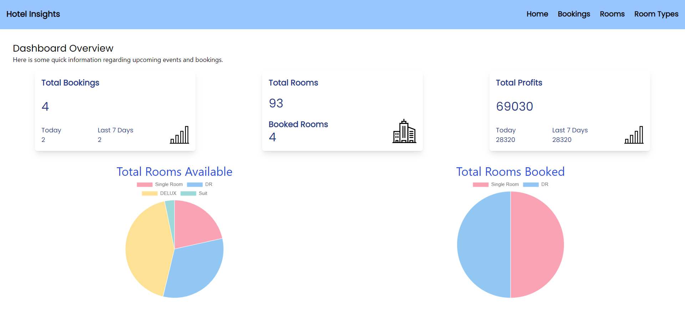
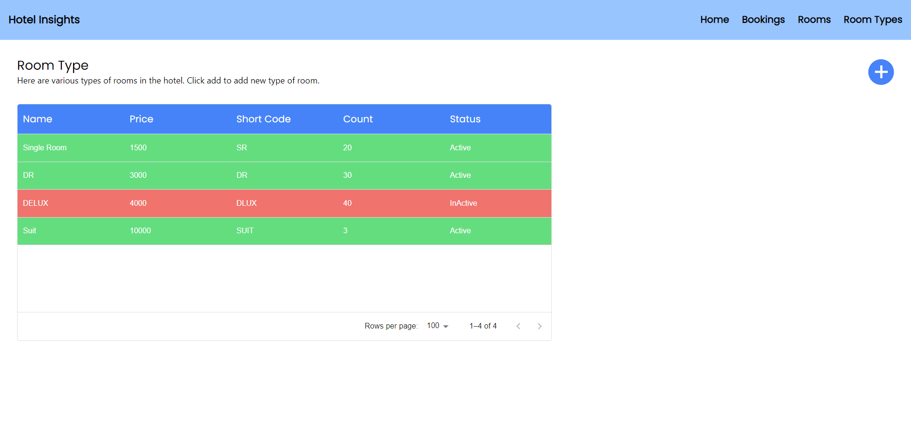
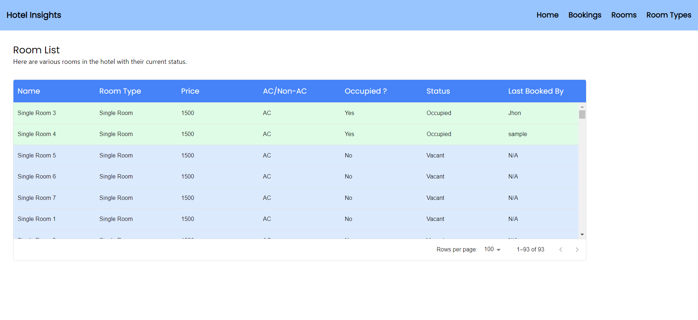
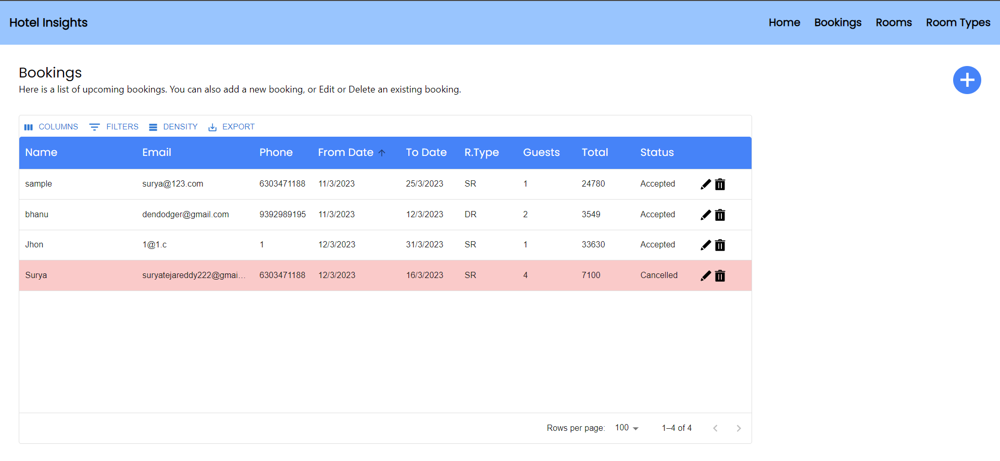
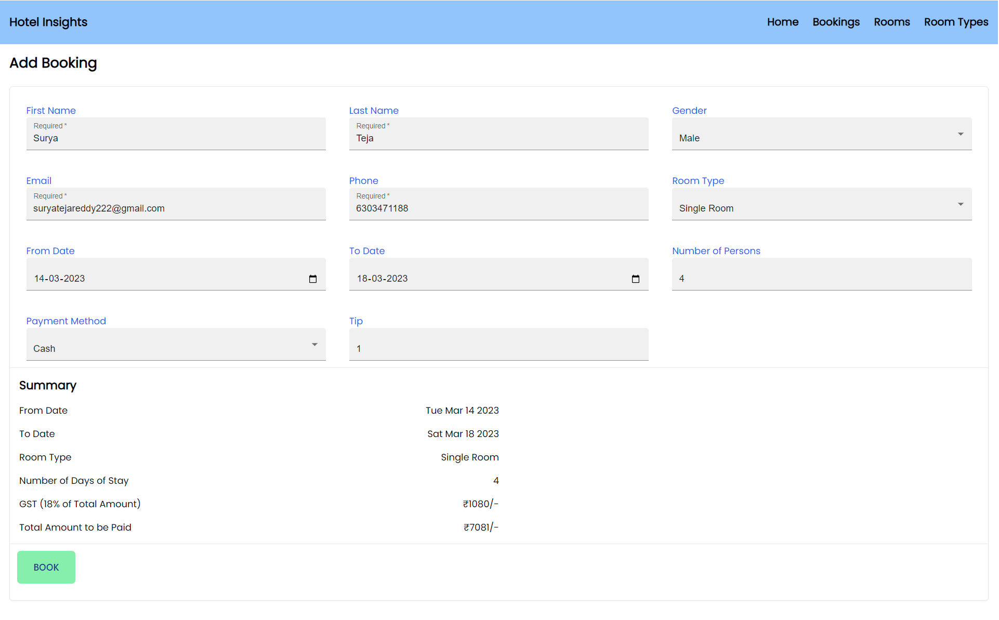
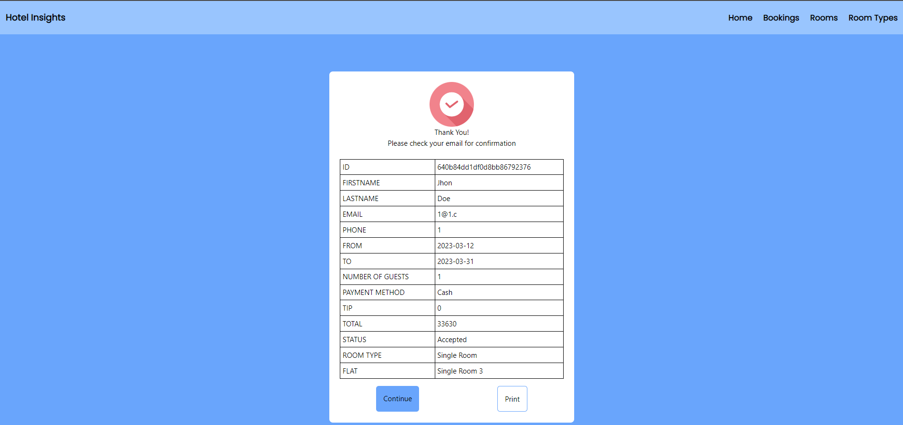
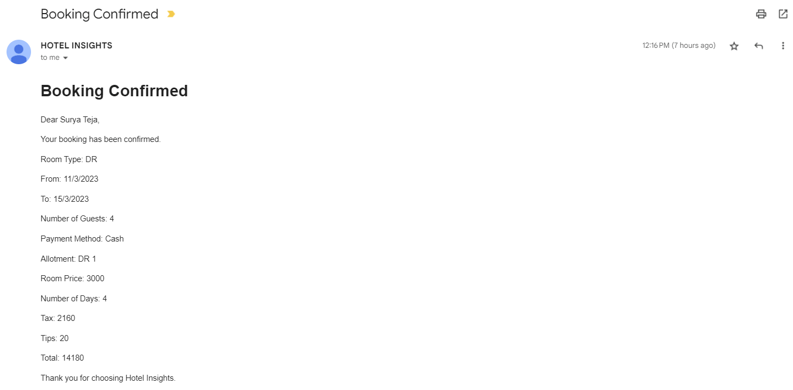

# Hotel Insights - An admin facing Hotel Management Website

This is a Hotel Admin website developed with Next.js and Mongoose, aimed at helping hotel owners manage their hotel operations such as bookings, room management.

This is a part of a take away assignment for a job interview.

## NoteWorthy Features

-   Fully responsive
-   Realtime data updates
-   Admin can book rooms for customers
-   Admin can manage bookings
-   Admin can manage rooms
-   An email is sent to the customer when a booking is made, edited or cancelled
-   For more info check below

## Overview

# Home Page


This is the responsive homepage of the Dashboard.

# Room Type


The admin can see details of various room types, and can add new room types.

# Rooms


The admin can manage activities of each individual room!

# Booking


The admin can book rooms for customers, and can also manage the bookings.
All the data is updated in realtime.

# Create Booking


The admin can create a booking for a customer with all the details updated in realtime.

# Booking Confirmation


The admin can see the booking confirmation, and can also edit or cancel the booking.

# Email


After a booking is made, edited or cancelled, an email is sent to the customer with all the details.

## Getting Started

To get started, clone the repository to your local machine:

```bash
git clone https://github.com/surya-teja-222/hotel-insights-admin-dashboard.git
```

## Prerequisites

To run this project on your local machine, you need to have the following installed:

Node.js
MongoDB

## Installing

To install the dependencies, run the following command:

```bash
pnpm install
```

## Setting Up the Environment Variables

You need to create a .env.local file in the root directory of the project, and add the following variables:

```makefile
MONGODB_URI=your_mongodb_uri
EMAIL_USER=YOUR_EMAIL
EMAIL_PASS=YOUR_EMAIL_PASSWORD
```

Replace your_mongodb_uri with the connection string to your MongoDB database and your_secret_key with a secret key of your choice.

## Running the Application

To run the application, use the following command:

```bash
pnpm dev
```

## Technologies Used

-   Next.js
-   Mongoose
-   Tailwind
-   Mongoose
-   Gsap
